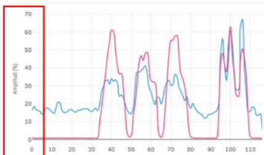
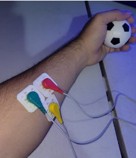

# MAYAS Biomedical Signal Repository

- 1) [Simultaneous BCG, PCG, EEG, and EMG Signal Study Database](#bcg-pcg-eeg-and-emg-database)
- 2) [EMG Database](#emg-envelope-type-signals)
- 3) [Wearable Mics PCG Data Database](#wearable-mics-pcg-data)

---

## BCG, PCG, EEG, and EMG Database

Download the **BCG_PCG.zip** file: This file contains raw data for both phonocardiogram (PCG) and ballistocardiogram (BCG) signals stored in NumPy format. [For EMG go here](#emg-envelope-type-signals). You can find the **BCG_PCG.zip** file in the repository.

Unzip the file: Once downloaded, unzip the **BCG_PCG.zip** file on your system. This will extract the individual signal files.
  
Understanding the Signal Files:
  
The extracted files will follow a naming convention that indicates the type of signal (S1:PCG or S2:BCG), activity state (Act, Post, Rest), and pressure level (e.g., 134 in the following example).   
Here's a breakdown:  
  
Filename format: [ID]_Act/Post/Rest_[Pressure]_S1/S2.npy  
ID: This is a reference number specific to the data collection.  
Act/Post/Rest: This indicates the activity state of the subject during the recording: Act (active), Post (post-activity), or Rest (resting).  
Pressure: This represents the pressure applied during the recording (e.g., 134 is average blood pressure).  
Signal type S1:PCG or S2:BCG.  
.npy: This extension signifies that the file stores the data in the NumPy format.  
  
Example:  
  
1_Act_134.0_S1.npy: This file contains the ID=1, PCG signal (S1) recorded from participant during an active state with a pressure of 134.  
1_Act_134.0_S2.npy: This file contains the ID=1, BCG signal from the same participant, recorded under the same conditions.  
  
Note:  

Please, consult the data documentation in [1] about adquisition details.  


This is example code in python to see the signals:

```
import numpy as np
import matplotlib.pyplot as plt
PCC=np.load('1_Act_134.0_S1.npy')
print(PCC.shape)
plt.subplot(2,1,1)
plt.plot(PCC[0:1500])

BCC=np.load('1_Act_134.0_S2.npy')
print(BCC.shape)
plt.subplot(2,1,2)
plt.plot(BCC[0:1500])

plt.show()
```


If you want to use the data, please cite

[1] RafaelGonzalez‑Landaeta, Brenda Ramirez & Jose Mejia. Estimation of systolic blood pressure by Random Forest using heart sounds and a ballistocardiogram. Scientifc Reports, (2022) 

[2] Rafael Gonzalez‑Landaeta & Jose Mejia, "M.A.Y.A.S Project: Creation of a database of physiological signals. Estimation of changes in blood pressure.", UACJ Institutional Repository, 2022
  
  
Data Disclaimer  
This database provides access to a collection of data for research and analysis purposes. The authors make no warranties or representations of any kind, express or implied, about the accuracy, completeness, or fitness for any particular purpose of the data.
-----------------------------------

# EMG Envelope-Type Signals

Measurements were taken using the **"EMG Raw Signal Collection Kit"** electrical muscle sensor module. The acquired signal was of the **envelope type**, not the raw signal (see Figure 1).

  
*Figure 1: Example of an EMG envelope signal.*

## Electrode Placement

For sEMG signal recording, three electrodes per channel were used (in this case, only one channel was necessary, so three electrodes were employed in total):  
- Two **active electrodes**, placed over the muscle belly.  
- One **reference electrode**, positioned below the two active electrodes.

This configuration helps obtain a cleaner signal compared to random electrode placement over the muscle and a reference electrode placed in an irrelevant anatomical region.

The inter-electrode distance was set to **20 millimeters**, and the electrodes were aligned **parallel to the muscle fibers** to optimize signal acquisition. Surface foam monitoring electrodes from **3M with conductive gel** were used for this purpose.

The following muscle locations were selected for signal acquisition:
- **Extensor digitorum**
- **Palmaris longus**
- **Flexor digitorum profundus**
- **Biceps brachii**

Among these, the **extensor digitorum** and **palmaris longus** muscles were the most consistently active during measurements.

  
*Figure 2: Example of electrode placement used for signal acquisition across volunteers, primarily over the extensor digitorum and palmaris longus muscles.*

The file name  NN_PP_GG.csv <br>
NN session number<br>
PP code asigned to a specific person<br>
GG grip type:<br><br>

Grip Codes:<br>
Cylindrical grip  _AC<br>
Spherical grip    _AE<br>
Pressure Grip     _AP<br>
Hook Grip         _AG<br>


If you want to use the data, please cite

[1] RafaelGonzalez‑Landaeta, Brenda Ramirez & Jose Mejia. Estimation of systolic blood pressure by Random Forest using heart sounds and a ballistocardiogram. Scientifc Reports, (2022) 

[2] Rafael Gonzalez‑Landaeta & Jose Mejia, "M.A.Y.A.S Project: Creation of a database of physiological signals. Estimation of changes in blood pressure.", UACJ Institutional Repository, 2022
  
  
Data Disclaimer  
This database provides access to a collection of data for research and analysis purposes. The authors make no warranties or representations of any kind, express or implied, about the accuracy, completeness, or fitness for any particular purpose of the data.


<br>
<br>
---

## Wearable Mics PCG Data

Phonocardiogram (PCG) signals recorded using multiple wearable microphones and sensors under different physiological conditions.
The data files are available in the [/data/Mics_Wearable_PCG_Data/](Mics_Wearable_PCG_Data) folder.

### 👥 Participant Demographics
PCG signals were acquired from **10 healthy volunteers** (4 females, 6 males) with varying body constitutions:
* **Age:** $23 \pm 1$ years
* **Height:** $169.9 \pm 10.2\text{ cm}$
* **Weight:** $73 \pm 17\text{ kg}$

---

### 🫀 Acquisition Protocol & Location
* **Auscultation Site:** Second left intercostal space (pulmonic area), identified prior to recording using a Littmann mechanical stethoscope.
* **Duration:** 30 seconds per trial.
* **Experimental Conditions:**
  1. **Rest:** Recorded after a 5-minute resting period.
  2. **Post-Exercise:** Recorded immediately after 2 minutes of physical activity (repeated squats).

---

### ⚙️ Hardware & Instrumentation
* **Sensors & Housing:**
  * **Electret, MEMS microphones, & PVDF film sensor:** Housed in custom 3D-printed acoustic chambers coupled to a stethoscope diaphragm (designed in SolidWorks, fabricated in PLA via additive manufacturing).
  * **Accelerometer & Contact microphone:** Secured directly to the chest using an elastic band to ensure stable mechanical contact.
* **Data Acquisition (DAQ):** National Instruments NI USB-6353 (16-bit) configured at a sampling rate of **1 kSa/s**.

---

### 📋 Ethics & Approval
* **Ethics Committee:** Approved by the Research Ethics Committee of the Autonomous University of Ciudad Juárez (UACJ) under approval number **CEI-2025-2-1658**.
* **Compliance:** Conducted in accordance with the Declaration of Helsinki. Written informed consent was obtained from all participants prior to data collection.

<br>
<br>
<br>
for all data in MAYAS repository <br>
Data Disclaimer  <br>
This database provides access to a collection of data for research and analysis purposes. The authors make no warranties or representations of any kind, express or implied, about the accuracy, completeness, or fitness for any particular purpose of the data.


